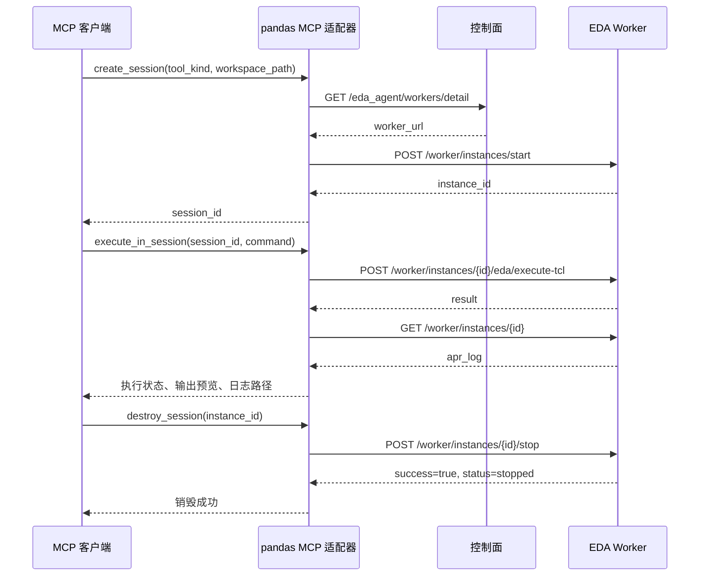

# pandas EDA Worker 的 MCP 接入方案

## 1. 目标与范围

在 pandas EDA worker HTTP API 上增加 MCP 适配层，使客户端通过统一工具完成 Innovus / PrimeTime 会话的创建、Tcl 执行和关闭。对外工具名称与 ScienceEDA 适配器保持一致，后端差异由适配层处理。

本文由原始接口笔记整理，并对照本目录的 `interactive_mcp_server.py` 描述当前实现。后续改进单独列出，不视为已实现功能。这里的 pandas 指 EDA worker 服务。

## 2. 调用流程



配置 `--worker-url` 时跳过发现步骤；发现结果会在当前 MCP 服务进程内缓存。

## 3. 环境与身份

- 使用 Python 3.10 或更新版本，并安装 `httpx`。
- 控制面与 worker 地址可达，后端具备 EDA 工具及有效许可证。
- `workspace_path` 必须是 MCP 本机存在的绝对目录，worker 也能以同一路径访问它。
- 用户名优先取 `--username`，其次取 `PANDAS_MCP_USERNAME`；未配置时执行 `whoami`，失败时使用 `getpass.getuser()`。
- 所有请求携带 `Content-Type: application/json` 和 `X-Username`。用户名请求头用于传递身份，实际认证与授权由后端部署决定。

| 参数 | 环境变量 | 默认值 |
| --- | --- | --- |
| `--endpoint` | `PANDAS_MCP_SANDBOX_ENDPOINT` | `http://127.0.0.1:8765` |
| `--worker-url` | `PANDAS_MCP_WORKER_URL` | 空，通过控制面发现 |
| `--username` | `PANDAS_MCP_USERNAME` | 当前系统用户 |

## 4. 接口设计

### 4.1 发现 worker

请求 `GET {endpoint}/eda_agent/workers/detail`，读取 `worker_url`：

```json
{
  "agent": {},
  "data": [{"worker_url": "http://worker.example:8765"}]
}
```

当前实现兼容 `data` 对象及数组；数组只读取第一项，不筛选其他 worker 或自动故障切换。缺少有效 URL 时返回工具错误。已知地址时可用 `--worker-url` 指定。

### 4.2 创建会话：create_session

MCP 输入：

```json
{"tool_kind": "primetime", "workspace_path": "/workspace/design"}
```

适配器校验本地目录及工具类型，生成 UUID hex 会话 ID，向 `POST {worker_url}/worker/instances/start` 发送：

```json
{
  "root_path": "/workspace/design",
  "eda_type": "pt",
  "instance_id": "4f8d2a9c7b2e4a0c8d9e6f1023456789"
}
```

| MCP 字段 | worker 字段 |
| --- | --- |
| `workspace_path` | `root_path` |
| 内部生成的会话 ID | `instance_id` |
| `tool_kind=primetime` | `eda_type=pt` |
| `tool_kind=innovus` | `eda_type=innovus` |

`success=true` 时优先使用 `data.instance_id`；未提供时使用内部生成的 ID。MCP 在文本 `content` 中返回会话 ID。调用方无需提供 `session_id` 或 `version`。

### 4.3 执行命令：execute_in_session

MCP 输入：

```json
{"session_id": "4f8d2a9c7b2e4a0c8d9e6f1023456789", "command": "puts hi"}
```

1. 请求 `POST {worker_url}/worker/instances/{session_id}/eda/execute-tcl`，请求体为 `{"command":"puts hi"}`。
2. 从响应的 `data.result` 获取输出，去掉开头的 `pt_shell>` 或 `innovus>` 及紧随的前导空白，作为 `output_preview`。
3. 请求 `GET {worker_url}/worker/instances/{session_id}`，将 `data.apr_log` 作为 `full_log_path`。

结果同时写入文本 `content` 和结构化 `structuredContent`：

| 字段 | 当前含义 |
| --- | --- |
| `state` | 成功为 `SUCCEEDED`，业务失败为 `FAILED` |
| `exit_code` | 适配器映射的 `0` 或 `1`，不是后端进程原始退出码 |
| `error` | 成功为 `null`；业务失败时包含 `TCL_ERROR` 与错误信息 |
| `output_preview` | 去除开头提示符后的命令输出 |
| `full_log_path` | 后端实例的完整交互日志路径；未提供时为空字符串 |

当前成功条件是 `success=true` 且 `data.result` 不含大小写不敏感的 `error` 子串。该启发式规则可能误判正常文本，也可能漏判其他错误，不能等同于严格的 Tcl 状态码。

日志路径属于后端文件系统，并不保证客户端可直接访问。若实例详情请求失败，当前适配器返回工具错误，即使 Tcl 请求已经完成。

### 4.4 关闭会话：destroy_session

输入字段名为 `instance_id`，其值是创建阶段返回的会话 ID：

```json
{"instance_id": "4f8d2a9c7b2e4a0c8d9e6f1023456789"}
```

请求 `POST {worker_url}/worker/instances/{instance_id}/stop`。只有同时满足 `success=true` 和 `data.status="stopped"` 才返回“销毁成功”，否则返回工具错误。

原始笔记将 `stopped` 写成关闭失败，此处已按实现纠正。重复关闭是否成功取决于后端的幂等行为。

## 5. HTTP 联调示例

以下 Bash 示例需要 `curl` 和 `python3`；请替换实际地址和工作区。示例用于验证 HTTP 接口，不替代 MCP 调用。

```bash
username="$(whoami)"
endpoint="http://control-plane.example:8765"

# 先发现 worker，再把响应中的 worker_url 填入下方变量。
curl -sS "${endpoint}/eda_agent/workers/detail" \
  -H "Content-Type: application/json" -H "X-Username: ${username}"

worker_url="http://worker.example:8765"
instance_id="$(python3 -c 'import uuid; print(uuid.uuid4().hex)')"

curl -sS -X POST "${worker_url}/worker/instances/start" \
  -H "Content-Type: application/json" -H "X-Username: ${username}" \
  -d "{\"root_path\":\"/workspace/design\",\"eda_type\":\"pt\",\"instance_id\":\"${instance_id}\"}"

# 确认 success=true；若 data.instance_id 与请求值不同，后续使用返回值。
curl -sS -X POST "${worker_url}/worker/instances/${instance_id}/eda/execute-tcl" \
  -H "Content-Type: application/json" -H "X-Username: ${username}" \
  -d '{"command":"puts hi"}'

curl -sS "${worker_url}/worker/instances/${instance_id}" \
  -H "Content-Type: application/json" -H "X-Username: ${username}"

curl -sS -X POST "${worker_url}/worker/instances/${instance_id}/stop" \
  -H "Content-Type: application/json" -H "X-Username: ${username}"
```

## 6. 异常处理与验收

本地参数校验、连接失败、非 JSON 返回、HTTP 错误及业务失败通过工具结果表达，并设置 `isError=true`。协议请求本身不合法时返回 JSON-RPC 错误。详细示例见[工具说明](README.md)。

验收顺序：

1. 验证控制面发现、指定 worker 直连和用户名传递。
2. 分别用 Innovus、PrimeTime 创建会话，核对类型映射及会话 ID。
3. 执行 `puts hi`，核对状态、预览和日志路径。
4. 执行预期失败的 Tcl，确认错误通过 MCP 返回。
5. 关闭会话，确认 `success=true`、`status=stopped`，检查重复关闭的实际行为。
6. 验证无效目录、非法 ID、不存在的会话和不可达后端等异常分支。

本目录已有真实后端联调脚本：

```bash
python check_backend.py --endpoint http://control-plane.example:8765 \
  --workspace-path /workspace/design --tool-kind primetime
```

以上为验收步骤，不代表已在实际部署中完成验证。

## 7. 后续改进

- 使用后端明确的 Tcl 错误类型或退出状态，替代 `error` 文本匹配。
- 定义多 worker 选择策略与会话到 worker 的固定对应关系。
- 日志查询失败时保留已取得的执行结果，单独报告日志查询问题。
- 增加可配置的 HTTP 超时；当前使用 `timeout=None`。对可能已经执行的命令，不应直接自动重试。
